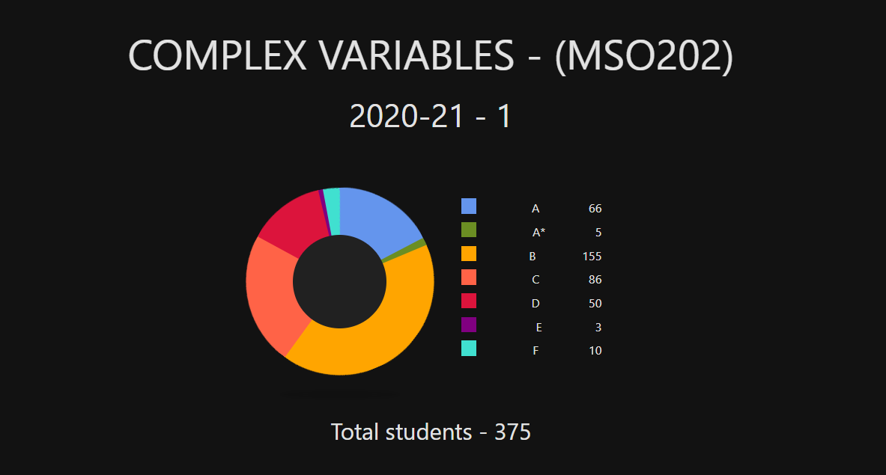
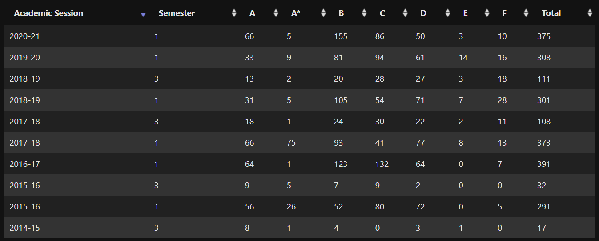

# MSO202a - Complex Variables

I did this course under <a href="https://www.iitk.ac.in/new/preena-samuel" target="_blank"><i><b>Prof. Preena Samuel</b></i></a>. This course is a DC for all batti. This is a complementary course, similar to the course <i>MTH101A - Real Analysis</i>, except here all the analysis will be done for complex numbers. This is a modular course, i.e. it runs for first half of the semester only.

### Instructor
Prof. Preena Sanuel was a very nice instructor overall. She explained the concepts very well. Her notes were very carefully curated so they were helpful. Surprisingly, we never saw her face throughout the semester :laughing:. Though she seems calm and nice, she is a strict. For instance, she refused to allow anyone to join the class 10 mins after the class has started, but it was perfectly fine if she got disconnected and rejoined. That was too hypocritical of her. Since this was the first time that an the courses were being conducted in an online mode, she did not realise that neither do all the students have high speed and unlimited internet access nor does everyone have an ipad. 

### Books
The suggested reference books for reading and practice included
- <a href="https://drive.google.com/file/d/1ypc_6chDFL7SegoZQd-BbpQnzb4ns-W8/view?usp=sharing" target="_blank"><i>Advanced Engineering Mathematics</i></a> by Erwin Kreyszig
- <i>Complex Analysis</i> by Stein and Shakarchi
- <i>Functions Of One Complex Variable</i> by Conway

### Pattern of Exam
- :page_facing_up: 3 objective quizzes were conducted for a total of 75% weightage in the course. In the first quiz, we had to annotate a pdf of an OMR sheet and submit it on gradescope for automatic grading. The second quiz was held on the HelloIITK platform. The third quiz was held with the help gradescope's MCQs test feature. The quizzes were very differently made. The first quiz was of about 40 marks, while the third quiz was just 10 marks, but had same weightage :shrugging:.
- :books: The Midsem (no endsem as it is a modular course) was of 25% weightage. It was also held using the MCQ test feature of gradescope. It was of 30 marks.

### Lectures & Course Content 
The course content seems very similar to MTH101A, with some extra conecepts related to complex numbers. So as MTH101A demanded regulaity and practice, so is the case in this course. And remember that since this course is a modular course, you would not get many chances to improve your total score. Many times, 1 mark in a quiz might represent 1% or more of the total course :disappointed_relieved:. So keep an eye, as you will not realise when the course will be over and you will regret later.

<table>
	<tr>
		<th colspan="3">Links</th>
	</tr>
	<tr>
		<td><a href="https://drive.google.com/drive/folders/1uNYEsaJhU2-nelssnGZn8t1iVMrGSwSx?usp=sharing" target="_blank">Lecture Notes</a></td>
		<td><a href="https://drive.google.com/drive/folders/13Bk04CBl6gLgJi6A-1vAK8EgBICafM6g?usp=sharing" target="_blank">Assignments</a></td>
		<td><a href="https://drive.google.com/drive/folders/1lIdzmkZ6laVyHTBb625jXyntqBwLaA26?usp=sharing" target="_blank">Exams Papers</a></td>
	</tr>
</table>

### Grading
The instructor never revealed any statistics or grade cutoffs. We believe that grading was indeed relative, or else more than half the class would have failed. The only problem was it being a modular course, at many places 1 mark in some exam had a lot of value in the total grade in the course. Also, there would be no endsem to recover your marks, midsem would be the one shot at getting marks. So please be careful.

