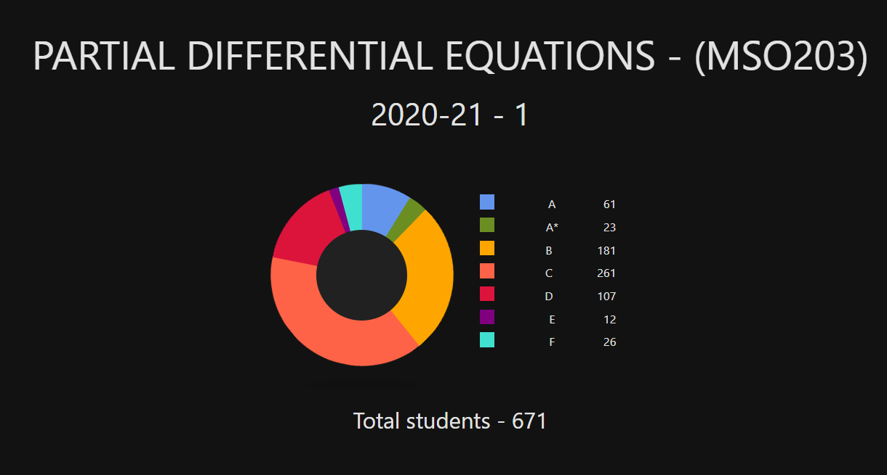
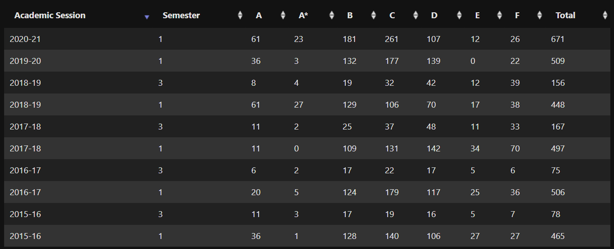

# MSO203b - Partial Differential Equations

I did this course under <a href="https://www.iitk.ac.in/new/prosenjit-roy" target="_blank"><i><b>Prof. Prosenjit Roy</b></i></a>. This course is a DC for all batti. This is a complementary course, similar to the second part of the course <i>MTH102A - Linear Algebra and Ordinary Differential Equations</i>, except here the main focus will be on analyzising partial differential equations and finding their solutions. This is a modular course, so it runs for the second half of the semester only.

### Instructor
Prof. Prosenjit Roy was a very nice instructor overall. He explained the concepts very well. 

### Books
The suggested reference book for reading and practice was <a href="https://drive.google.com/file/d/17LRLKZDQkQGOazekh-qfzJuP1_BmaFiR/view?usp=sharing" target="_blank"><i>Advanced Engineering Mathematics</i></a> by Erwin Kreyszig

### Pattern of Exam
- :page_facing_up: 4 Assignments were given to complete and submit. They caried a total of 12% weightage (3% each).
- :book: 3 quizzes were conducted on HellotIITK portal, out of which the best 2 were considered for a total of 26% weightage (13% each) in the course. These quizzes were a mixture of both objective and subjective questions. The quizzes were pretty straight-forward, will 1-2 advanced questions which required a little thinking.
- :books: The Endsem (no midsem as it is a modular course) was of 62% weightage. It was held in the same way as the quizzes, i.e. it was a mixture of objective and subjective quiestions.

### Lectures & Course Content 
The course content is very easy. A little amount of practice and solving the assignments will help you easily grasp the concepts. It is highly formula based. Every problem can be solved using some or the other formula or theorem taught in the course. The course content seemed very light, though that perception might vary from person to person. And remember that since this course is a modular course, you would not get many chances to improve your total score. Many times, 1 mark in a quiz might represent 1% or more of the total course :disappointed_relieved:. So keep an eye, as you will not realise when the course will be over and you will regret later.

<table>
	<tr>
		<th colspan="2">Links</th>
	</tr>
	<tr>
		<td><a href="https://drive.google.com/drive/folders/1PgKPXz5HiWUOleGTQjGflXfEIaisoSw6?usp=sharing" target="_blank">Assignments</a></td>
		<td><a href="https://drive.google.com/drive/folders/1OVcFT8_TZqgRbX4S9x7POoOQ4WXZqozd?usp=sharing" target="_blank">Exams Papers</a></td>
	</tr>
</table>

### Grading
Since the course content was so simple, and due to the rampant cheating that had began and students had found ways to secretly collaborate, the course scores soared like I have never seen before. As far I can recall, A grade was given above 92% (approx), and B was given above 80% (approx). This grading scheme looks so unfair but it wasn't. Grade cutoffs were finalised looking at the relative scores of the students and a lot of students had scored above 90%.

